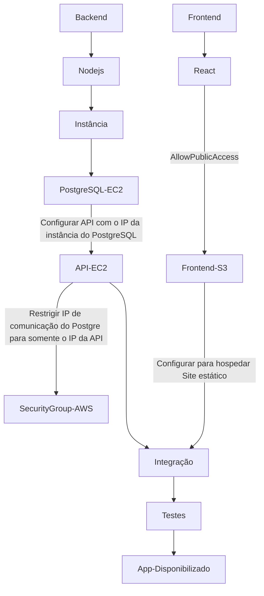

[JAVASCRIPT__BADGE]: https://img.shields.io/badge/JavaScript-000?style=for-the-badge&logo=javascript
[TYPESCRIPT__BADGE]: https://img.shields.io/badge/TypeScript-007ACC?style=for-the-badge&logo=typescript&logoColor=white
[REACT__BADGE]: https://img.shields.io/badge/React-61DAFB?style=for-the-badge&logo=react&logoColor=black
[CSS3__BADGE]: https://img.shields.io/badge/CSS3-%231572B6.svg?style=for-the-badge&logo=css3&logoColor=white
[PRISMA__BADGE]: https://img.shields.io/badge/Prisma-2D3748?style=for-the-badge&logo=prisma&logoColor=white
[VITE__BADGE]: https://img.shields.io/badge/Vite-646CFF?style=for-the-badge&logo=vite&logoColor=white
[CLERK__BADGE]: https://img.shields.io/badge/Clerk-3F4451?style=for-the-badge&logo=clerk&logoColor=white
[AWS__BADGE]: https://img.shields.io/badge/AWS-%23FF9900.svg?style=for-the-badge&logo=amazon-aws&logoColor=white
[Postgres__BADGE]: https://img.shields.io/badge/postgres-%23316192.svg?style=for-the-badge&logo=postgresql&logoColor=white

<h1 align="center" style="font-weight: bold;"> Green Sphere Store Informações para o Deploy na Amazon AWS</h1>

![JAVASCRIPT][JAVASCRIPT__BADGE]
![TYPESCRIPT][TYPESCRIPT__BADGE]
![REACT][REACT__BADGE]
![CSS3][CSS3__BADGE]
![PRISMA][PRISMA__BADGE]
![Postgres][Postgres__BADGE]
![VITE][VITE__BADGE]
![CLERK][CLERK__BADGE]
![AWS][AWS__BADGE]

<a href="#about">Sobre</a> •
<a href="#init">Informações Iniciais</a> •
<a href="#deploy">Como Realizar o Deploy</a> •
 •
<a href="#resources">Links Úteis</a>

<h2 id="about">📌 Sobre</h2>

A **_Green Sphere Store_** é um projeto criado para desenvolver uma plataforma de e-commerce responsiva e funcional para uma loja fictícia de plantas. Os usuários podem navegar por plantas, registrar novas plantas e aprender mais sobre os desenvolvedores.

O projeto foi implementado utilizando React, TypeScript e Clerk para autenticação de usuários. Ele conta com funcionalidades como registro e exibição dinâmica de plantas, proteção de rotas e interações com uma interface amigável ao usuário.

<h2 id='init'>🚩 Informações Iniciais</h2>

**O deploy do [projeto desenvolvido](https://github.com/g-Miyata/squard-desafio2-GreenSphere/blob/main/README.md) será realizado da seguinte forma:**

- A API será hospedada em uma instância EC2
- O banco de dados será hospedado em outra instância EC2
- A aplicação frontend React será hospedada em um bucket no S3 comunicando-se com a API do backend. O bucket será **público**.

**Dados para login na aplicação:**

- Link de acesso: ***https://tinyurl.com/green-sphere-store***
- Clique em Sign In na tela inicial;
- Clique para logar com google;

  

- email: _desafio3uolcompass@gmail.com_
- senha: _desafio3compass_

<h2 id='deploy'>☁️ Como Realizar o Deploy</h2>

### Esquema Geral:

### Orientações para realizar o deploy:

### Resumo do Processo de Deploy do Projeto

### ✅ Todo-List

**Instruções mais detalhadas de cada etapa disponibilizadas nos links**

1. - [ ] [**Criação e Configuração da Instância EC2 do banco de dados na AWS**](./banco-instancia.md)
   - - [ ] Configurar security group para abrir a porta 5432 para a instância da API.
   - - [ ] Adicionar configurar, no diretório da API, um service:postgres no <kbd>docker-compose.yml</kbd> para criar container do postgres
   - - [ ] Subir instância no EC2 com o sistema operacional Ubuntu
   - - [ ] [**Instalar o Docker e Docker Compose na instância**](./deploy_backend.md)
   - - [ ] Baixar resposiório do GitHub
   - - [ ] Realizar o docker-compose up do container do PostgreSQL
2. - [ ] [**Criação e Configuração da Instância EC2 da API em nodejs na AWS**](./api-instancia.md)
   - - [ ] Configurar security group para abrir a porta 3000 para teste externo e comunicação com o frontend
   - - [ ] Mudar o IP de comunicação com o banco de dados para **_<IP da instância>:5432_**
   - - [ ] Adicionar configurar, no diretório da API, um <kbd>Dockerfile</kbd> um service:api no <kbd>docker-compose.yml</kbd> para criar container da API
   - - [ ] Subir instância no EC2 com o sistema operacional Ubuntu
   - - [ ] [**Instalar o Docker e Docker Compose na instância**](./deploy_backend.md)
   - - [ ] Baixar resposiório do GitHub
   - - [ ] Realizar o docker-compose up do container da API
3. - [ ] [**Deploy do Frontend**](./deploy_frontend.md)
   - - [ ] Atualizar a URL da API no frontend para o IP da instância da API "http://<IP-da-instância-API>:3000"
   - - [ ] Criar Bucket para hospedagem de sites estáticos no S3 com permissão de acesso público
   - - [ ] Fazer o upload dos arquivos do build para o bucket do S3.

4. - [ ] Realizar testes
   - - [ ] **Banco de Dados:** Verificação das tabelas e dados inseridos manualmente.
   - - [ ] **API:** Testes de requisições no Insomnia ou Postman confirmando comunicação com o banco.
   - - [ ] **Frontend:** Requisições bem-sucedidas ao backend hospedado na instância da API.

Com isso, o deploy do sistema está completo, com cada componente (banco, API e frontend) devidamente configurado e funcional.

<h2 id="colab">🖌 Autor</h2>

<table align="center">
  <tr style="display: flex; justify-content: space-around;" >
    <td align="center">
       
      <b>Guilherme Miyata</b> 
      
      
    </td>
  </tr>
</table>

<h2 id="resources">📄 Links úteis</h2>

- [🛢️ Instância DB](./banco-instancia.md)
- [🛢️ Instância API](./api-instancia.md)
- [🛢️ Backend Deploy](./deploy_backend.md)
- [⚛ Frontend Deploy](./deploy_frontend.md)
