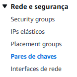
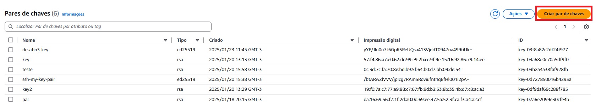
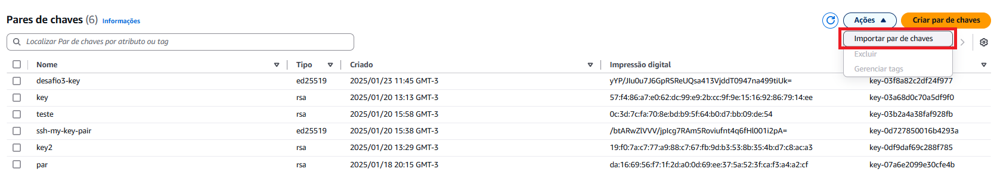
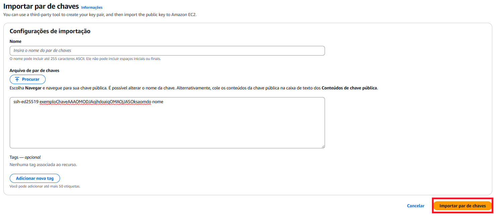
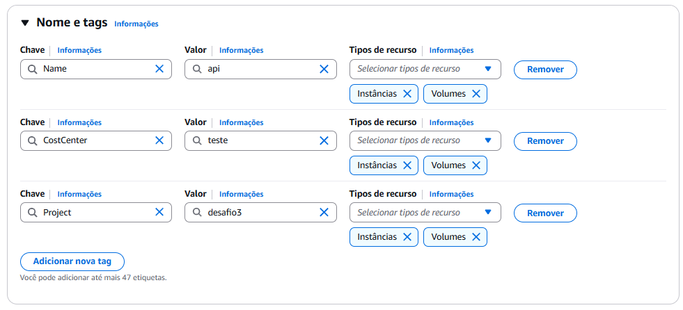

[AWS__BADGE]: https://img.shields.io/badge/AWS-%23FF9900.svg?style=for-the-badge&logo=amazon-aws&logoColor=white
[NodeJS__BADGE]: https://img.shields.io/badge/node.js-6DA55F?style=for-the-badge&logo=node.js&logoColor=white

<h1  style="font-weight: bold;"> Green Sphere Store - Criação da Instância para API</h1>

<div align="center">

![AWS][AWS__BADGE]
![NodeJS][NodeJS__BADGE]

<a href="#about">Sobre</a> •
<a href="#config">Configurações Iniciais</a> •
<a href="#EC2">Criação da Instância EC2</a> •
<a href="#resources">Links Úteis</a>

</div>

<h2 id="about">📌 Sobre</h2>

Esse documento visa informar instruções para subir uma instância EC2 na Amazon AWS para hospedar a API do projeto "Green Sphere Store".

<h2>⚙️ Configurações iniciais</h2>

Antes de subir a instância:

1. Criar VPC (Virtual Private Cloud) - [Instruções](https://israelbarberino-dev.notion.site/VPC-Virtual-Private-Cloud-12ea01dcbda18000bd5aee45e22568ad)

2. Criar Security Group

   1. Selecione a opção

    <div align="center">
    
    

    </div>

   2. Crie um novo grupo (Grupo servirá tanto para api quanto para o DB)

    <div align="center">

   
   
   
   
   
    </div>

3. Criar chave ssh e importá-la 🔑

   1. Criando chave ed25519, abra o terminal e execute:

      ```bash
      ssh-keygen -t ed25519 -C "teste Key" -f ~/.ssh/minha_chave
      ```

      isso criará:

      - <kbd>~/.ssh/minha_chave</kbd> (chave privada)
      - <kbd>~/.ssh/minha_chave.pub</kbd> (chave pública)

      em caso de dúvida, ver [mais instruções...](https://www.youtube.com/watch?v=dk5aPHalZgc)

      Agora, siga os passos para importar a chave:

    <div align="center">

   
   
   
   Procure o arquivo e importe ou escreva o conteúdo da chave pública:
   
      </div>

<h2 id="EC2">💻 Criação da Instância EC2</h2>

Procure pelo serviço de EC2

<div align="center">


Siga os passos:




> [!TIP]
> Escolha a imagem do Ubuntu (já possui git instalado)


</div>

Com isso você terá sua instância da API, se já tiver a instância do seu do DB criada, está pronto para realizar o [Deploy do Backend](./deploy_backend.md), se não, crie a [Instância do Banco de Dados](./banco-instancia.md)

<h2 id="colab">🖌 Autor</h2>

<table align="center">
  <tr style="display: flex; justify-content: space-around;" >
    <td align="center">
      <br>
      <b>Guilherme Miyata</b><br>
      <a href="https://github.com/g-Miyata">
        
      </a>
      <a href="https://www.linkedin.com/in/guilherme-miyata-612a71219/">
        
      </a>
    </td>
  </tr>
</table>

<h2 id="resources">📄 Links úteis</h2>

- [📚 Backend Deploy](./deploy_backend.md)
- [🎥 Frontend Deploy](./deploy_frontend.md)
- [📚 Instância DB](./banco-instancia.md)
