[Postgres__BADGE]: https://img.shields.io/badge/postgres-%23316192.svg?style=for-the-badge&logo=postgresql&logoColor=white
[AWS__BADGE]: https://img.shields.io/badge/AWS-%23FF9900.svg?style=for-the-badge&logo=amazon-aws&logoColor=white

<div align="center">

<h1  style="font-weight: bold;"> Green Sphere Store<br>Criação da Instância para o Banco de Dados</h1>

![AWS][AWS__BADGE]
![Postgres][Postgres__BADGE]

<a href="#about">Sobre</a> •
<a href="#config">Configurações Iniciais</a> •
<a href="#EC2">Criação da Instância EC2</a> •
<a href="#colab">Autor</a> •
<a href="#resources">Links Úteis</a>

</div>

<h2 id="about">📌 Sobre</h2>

Este documento detalha os passos para configurar uma instância EC2 na Amazon AWS e hospedar o banco de dados PostgreSQL para o projeto **Green Sphere Store**.

<h2 id='config'>⚙️ Configurações Iniciais</h2>

Antes de criar a instância EC2, siga as etapas abaixo:

### 1. Criar VPC (Virtual Private Cloud)

Pode utilizar a mesma da API, caso ja tenha criado, se não:

Siga as [instruções detalhadas aqui](https://israelbarberino-dev.notion.site/VPC-Virtual-Private-Cloud-12ea01dcbda18000bd5aee45e22568ad).

<div align="center">

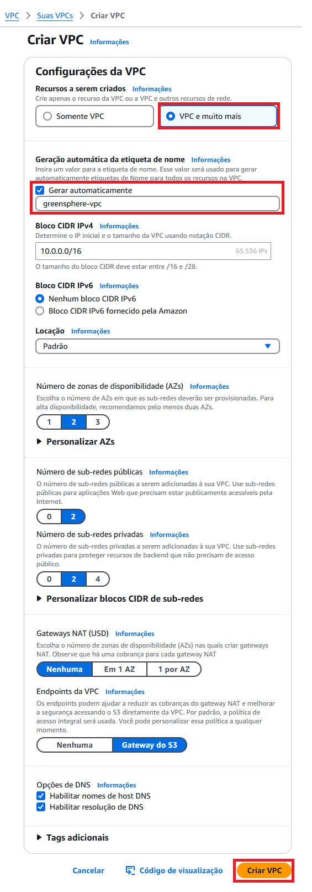

</div>

### 2. Criar Security Group

1.  Selecione a opção

    <div align="center">

    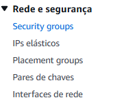

    </div>

2.  No console da AWS, crie um novo **Security Group** que será usado tanto para a API quanto para o banco de dados:

<div align="center">

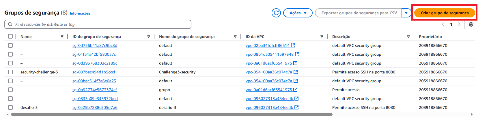
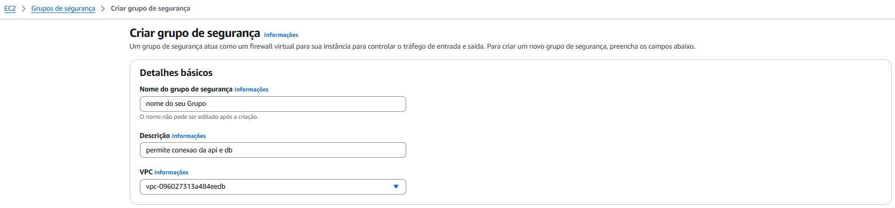
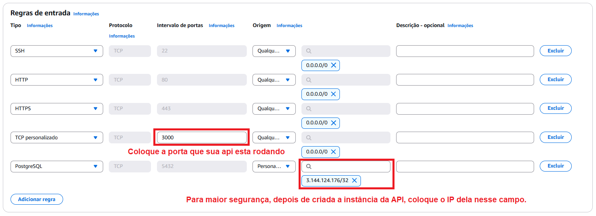
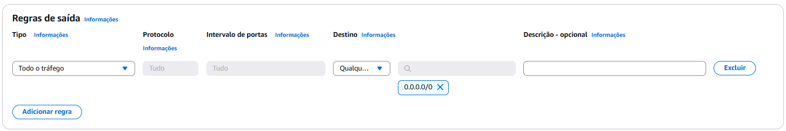


</div>

<h2 id="EC2">💻 Criação da Instância EC2</h2>

1. Procure pelo serviço **EC2** no console da AWS.

<div align="center">

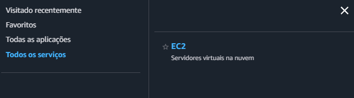

</div>

2. Crie uma instância seguindo os passos abaixo:

<div align="center">

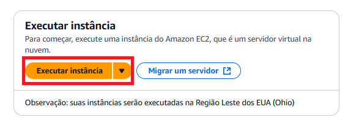
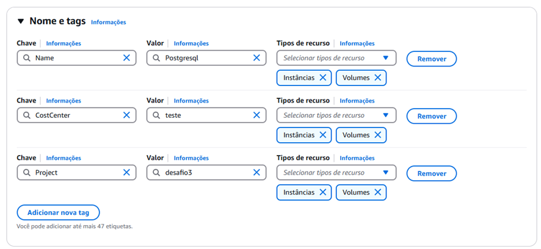

Crie uma chave

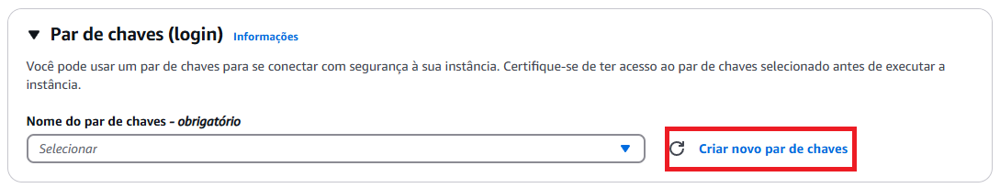
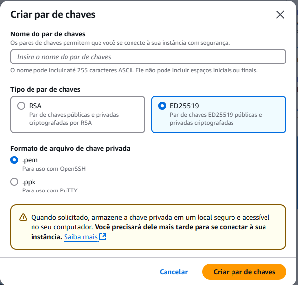

> [!IMPORTANT]
>
>  <div style="border-left: 4px solid purple; padding: 10px; background: rgba(130, 80, 223, 0.2);">
> Atente-se ao local onde foi realizado o download da chave.
> </div>

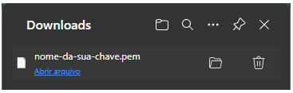

> [!TIP]
>
> <div style="border-left: 4px solid #4CAF50; padding: 10px; background: rgba(76, 175, 80, 0.3);">
>  <strong>Tip:</strong> Escolha a imagem do Ubuntu, pois ela já vem com o Git instalado.
> </div>

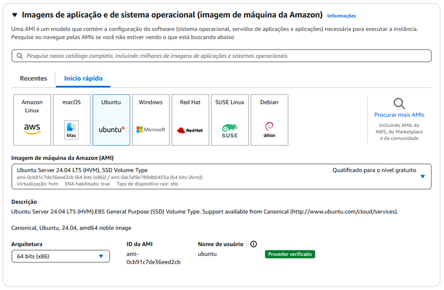
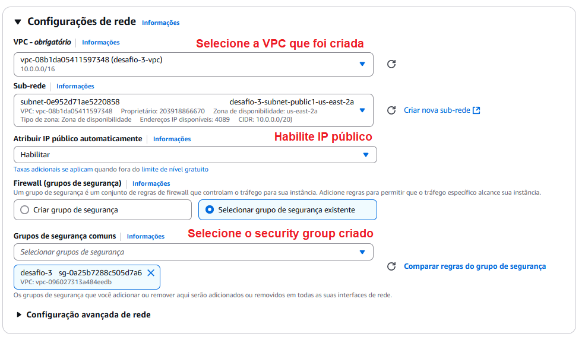
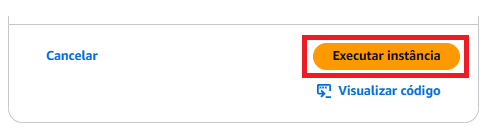

</div>

<h2 id="connect">🔗 Conectar com a Instância</h2>

Verifique a instância criadas:

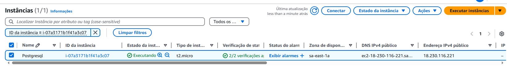

Espere gerar o IP público e faça a conexão conforme os passos:

1. Veja como se conectar a instância:

<div align="center">

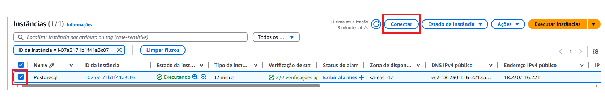

Escolha Cliente SSH e copie o com comando exemplo:

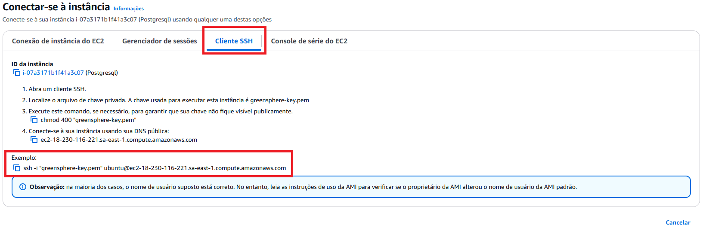

Abra o terminal e execute o comando copiado:

```bash
PS caminho/da/chave/baixada> ssh -i "sua-chave.pem" ubuntu@<IP-Publico-da-sua-Instância>
```

Se receber a resposta:

```makefile
ubuntu@<ip-da-instância>:~$
```

</div>

Com isso você terá sua a confirmação de que sua instância do Banco de Dados Postgresql criada. O próximo passo agora é configurá-la, acesse as [**Instruções**](./deploy_backend.md).

<h2 id='next'>🏃🏻‍♀️ Próximos passos</h2>

1.  [Configurar Instância do Banco para o PostgreSQL](./deploy_backend.md)
2.  [Criar Instância para a API](./api-instancia.md)
3.  [Configurar Instância da API](./deploy_backend.md)
4.  [Deploy Frontend](./deploy_frontend.md)

<details>
<summary>✅ Todo-List</summary>

1. - [ ] [**Criação e Configuração da Instância EC2 do banco de dados na AWS**](./banco-instancia.md)
   - - [x] Configurar security group para abrir a porta 5432 para a instância da API.
   - - [x] Adicionar configurar, no diretório da API, um service:postgres no <kbd>docker-compose.yml</kbd> para criar container do postgres
   - - [x] Subir instância no EC2 com o sistema operacional Ubuntu
   - - [ ] [**Instalar o Docker e Docker Compose na instância**](./deploy_backend.md)
   - - [ ] Baixar resposiório do GitHub
   - - [ ] Realizar o docker-compose up do container do PostgreSQL
2. - [ ] [**Criação e Configuração da Instância EC2 da API em nodejs na AWS**](./api-instancia.md)
   - - [ ] Configurar security group para abrir a porta 3000 para teste externo e comunicação com o frontend
   - - [ ] Mudar o IP de comunicação com o banco de dados para **_<IP da instância>:5432_**
   - - [ ] Adicionar configurar, no diretório da API, um <kbd>Dockerfile</kbd> um service:api no <kbd>docker-compose.yml</kbd> para criar container da API
   - - [ ] Subir instância no EC2 com o sistema operacional Ubuntu
   - - [ ] [**Instalar o Docker e Docker Compose na instância**](./deploy_backend.md)
   - - [ ] Baixar resposiório do GitHub
   - - [ ] Realizar o docker-compose up do container da API
3. - [ ] [**Deploy do Frontend**](./deploy_frontend.md)
   - - [ ] Atualizar a URL da API no frontend para o IP da instância da API "http://<IP-da-instância-API>:3000"
   - - [ ] Criar Bucket para hospedagem de sites estáticos no S3 com permissão de acesso público
   - - [ ] Fazer o upload dos arquivos do build para o bucket do S3.
4. - [ ] Realizar testes
   - - [ ] **Banco de Dados:** Verificação das tabelas e dados inseridos manualmente.
   - - [ ] **API:** Testes de requisições no Insomnia ou Postman confirmando comunicação com o banco.
   - - [ ] **Frontend:** Requisições bem-sucedidas ao backend hospedado na instância da API.

</details>

<h2 id="colab">🖌 Autor</h2>

<table align="center">
  <tr style="display: flex; justify-content: space-around;" >
    <td align="center">
      <br>
      <b>Guilherme Miyata</b><br>
      <a href="https://github.com/g-Miyata">
        
      </a>
      <a href="https://www.linkedin.com/in/guilherme-miyata-612a71219/">
        
      </a>
    </td>
  </tr>
</table>

<h2 id="resources">📄 Links úteis</h2>

- [🛢️ Backend Deploy](./deploy_backend.md)
- [⚛ Frontend Deploy](./deploy_frontend.md)
- [🛢️ Instância API](./api-instancia.md)
