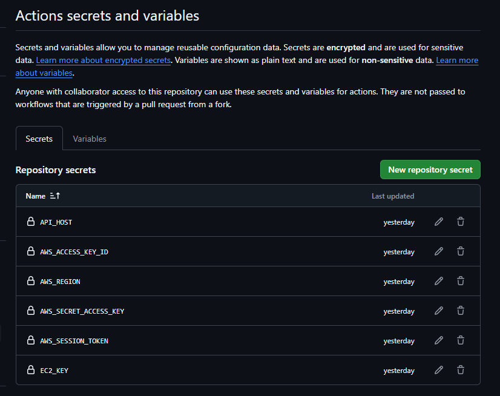
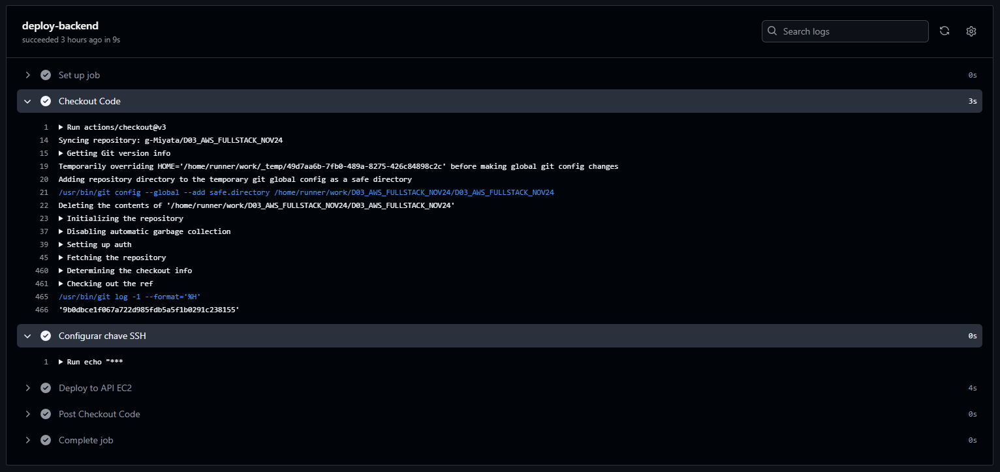
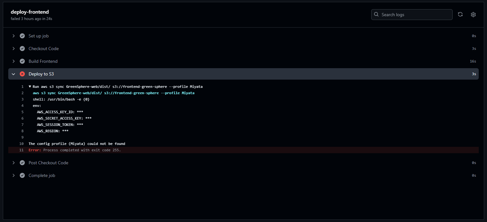

[AmazonS3__BADGE]: https://img.shields.io/badge/Amazon%20S3-FF9900?style=for-the-badge&logo=amazons3&logoColor=white
[AWS__BADGE]: https://img.shields.io/badge/AWS-%23FF9900.svg?style=for-the-badge&logo=amazon-aws&logoColor=white
[VITE__BADGE]: https://img.shields.io/badge/Vite-646CFF?style=for-the-badge&logo=vite&logoColor=white
[REACT__BADGE]: https://img.shields.io/badge/React-61DAFB?style=for-the-badge&logo=react&logoColor=black
[Postgres__BADGE]: https://img.shields.io/badge/postgres-%23316192.svg?style=for-the-badge&logo=postgresql&logoColor=white
[GitHubActions__BADGE]: https://img.shields.io/badge/github%20actions-%232671E5.svg?style=for-the-badge&logo=githubactions&logoColor=white
[GitHub__BADGE]: https://img.shields.io/badge/github-%23121011.svg?style=for-the-badge&logo=github&logoColor=white

<div align="center">

<h1  style="font-weight: bold;"> Green Sphere Store<br> CI/CD - Deploy Automatizado com Github Actions</h1>

![AWS][AWS__BADGE]
![Postgres][Postgres__BADGE]
![Amazon S3][AmazonS3__BADGE]
![REACT][REACT__BADGE]
![VITE][VITE__BADGE]
![GitHub][GitHub__BADGE]
![GitHub Actions][GitHubActions__BADGE]

<a href="#overview">Visão Geral</a> •
<a href="#aws">Configurações AWS</a> •
<a href="#github">Configurações GitHub Actions</a> •
<a href="#test">Teste o Deploy</a> •
<a href="#colab">Autor</a> •
<a href="#resources">Links Úteis</a>

</div>

<h2 align="center">🚀 Configuração do Deploy Automático com GitHub Actions e AWS EC2/S3</h2>

Este guia descreve como configurar o deploy automático da API e do Frontend para a AWS sempre que houver um **push ou merge na branch** <kbd>main</kbd>.

<h3 id="overview">📌 Visão Geral</h3>

- **API:** Hospedada em uma instância EC2 rodando via Docker Compose.
- **Banco de Dados:** Em uma instância separada da EC2 para manter a API e o DB isolados.
- **Frontend:** Hospedado em um bucket S3 público para servir como um site estático.

<h2 id= "aws">⚙️ Configurações AWS</h2>

### Instâncias EC2

1.  **Antes de seguir, certifique-se de que as instâncias EC2 já estão criadas e configuradas corretamente:**

    - Docker e Docker Compose instalados em ambas as instâncias
    - O repositório do GitHub já está clonado na instância da API.
    - As portas corretas estão liberadas no Security Group:

      - **Banco de Dados (EC2-DB):**

        - Porta 5432 (PostgreSQL) aberta apenas para a instância da API.

      - **API (EC2-API):**
        - Porta 3000 (para comunicação com o frontend).
        - Porta 22 (para SSH, apenas para seu IP local).

2.  **Criar um Usuário IAM para o Deploy**

    1.  Vá até o **IAM** (Identity and Access Management).
    2.  Crie um usuário IAM chamado _github-actions-deploy_, por exemplo.
    3.  Conceda as seguintes permissões:
        - **AmazonS3FullAccess** (para upload no S3).
        - **AmazonEC2FullAccess** (para permitir deploy na EC2).
        - Ou crie uma política personalizada para permitir acesso apenas ao bucket do frontend.
    4.  Copie as credenciais (<kbd>Access Key ID</kbd> e <kbd>Secret Access Key</kbd>).

> [!IMPORTANT]
> Guarde essas credenciais, pois elas serão usadas no GitHub Actions.

<h2 id="github">⚙️ Configuração do GitHub Actions</h2>

### Agora, vamos configurar o deploy automático da API e do frontend via GitHub Actions.

1.  Vá até o repositório no GitHub.
2.  Acesse Settings → Secrets and Variables → Actions → New Repository Secret.
3.  Adicione as seguintes variáveis:

    **Variáveis para API (EC2):**

    - <kbd>EC2_KEY</kbd> → Chave privada SSH (<kbd>.pem</kbd>) para acessar a EC2:
    - <kbd>API_HOST</kbd> → IP público da instância EC2 da API.

    **Variáveis para o Frontend (AWS S3):**

    - <kbd>AWS_ACCESS_KEY_ID</kbd> → Access Key ID do usuário IAM.
    - <kbd>AWS_SECRET_ACCESS_KEY</kbd> → Secret Key do usuário IAM.
    - <kbd>AWS_REGION</kbd> → Região da AWS (ex: <kbd>us-east-2</kbd>).

<div align="center">



</div>

1.  Criar o Arquivo do GitHub Actions

    Crie o arquivo .github/workflows/deploy.yml com o seguinte conteúdo:

    ```yaml
    name: Deploy to EC2 and S3

    on:
      push:
        branches:
          - main

    jobs:
      deploy-backend:
        runs-on: ubuntu-latest

        steps:
          - name: Checkout Code
            uses: actions/checkout@v3

          - name: Configurar chave SSH
            run: |
              echo "${{ secrets.EC2_KEY }}" > private_key.pem
              chmod 600 private_key.pem

          - name: Deploy to API EC2
            env:
              HOST: ${{ secrets.API_HOST }}
              USER: ubuntu
            run: |
              ssh -o StrictHostKeyChecking=no -i private_key.pem $USER@$HOST << 'EOF'
              set -e
              cd /home/ubuntu/D03_AWS_FULLSTACK_NOV24
              git pull origin main
              docker compose down
              docker compose up -d api
              EOF

      deploy-frontend:
        runs-on: ubuntu-latest

        steps:
          - name: Checkout Code
            uses: actions/checkout@v3

          - name: Build Frontend
            run: |
              cd GreenSphere-web
              npm install
              npm run build

          - name: Deploy to S3
            env:
              AWS_ACCESS_KEY_ID: ${{ secrets.AWS_ACCESS_KEY_ID }}
              AWS_SECRET_ACCESS_KEY: ${{ secrets.AWS_SECRET_ACCESS_KEY }}
              AWS_SESSION_TOKEN: ${{ secrets.AWS_SESSION_TOKEN }}
              AWS_REGION: ${{ secrets.AWS_REGION }}
            run: |
              aws s3 sync GreenSphere-web/dist/ s3://frontend-green-sphere --acl public-read
    ```

<h2 id="test">🧪 Teste o Deploy</h2>

1. Faça um commit e push para a branch <kbd>main</kbd>:

   ```bash
     git add .
     git commit -m "Configuração do deploy automático"
     git push origin main
   ```

2. Acompanhe o progresso no GitHub Actions:

   - Vá para **Actions** no repositório do GitHub e veja o workflow rodando.

   

   - Se houver erro, confira os logs.

   

   - Após o deploy, verifique:
     - **API:** _http://**<IP_da_API>**:3000_
     - **Frontend:** _https://link-público-da-sua-bucket-S3_

   Se a API e o frontend se comunicam corretamente, o deploy foi bem-sucedido!

<h2 id="conclusion">🏁 Considerações Finais</h2>

- [x] Deploy automático sempre que houver push/merge na main.
- [x] API e Banco separados para segurança e escalabilidade.
- [x] Frontend hospedado no S3.
- [x] GitHub Actions + AWS para o deploy rápido e automatizado.

O projeto está 100% automatizado! Se precisar ajustar algo, basta modificar o deploy.yml.

<h2 id="colab">🖌 Autor</h2>

<table align="center">
  <tr style="display: flex; justify-content: space-around;" >
    <td align="center">
      <br>
      <b>Guilherme Miyata</b><br>
      <a href="https://github.com/g-Miyata">
        
      </a>
      <a href="https://www.linkedin.com/in/guilherme-miyata-612a71219/">
        
      </a>
    </td>
  </tr>
</table>

<h2 id="resources">📄 Links úteis</h2>

- [🎥 Deploy Automático para instância EC2 da AWS utilizando GitHub Actions](https://www.youtube.com/watch?v=i8aRDekvyS0)
- [🎥 Deploy React no S3 da AWS](https://www.youtube.com/watch?v=vosy6rEeOiw)
- [🛢️ Backend Deploy](./deploy_backend.md)
- [🛢️ Instância API](./api-instancia.md)
- [🛢️ Instância DB](./banco-instancia.md)
