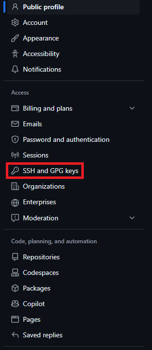
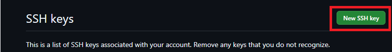
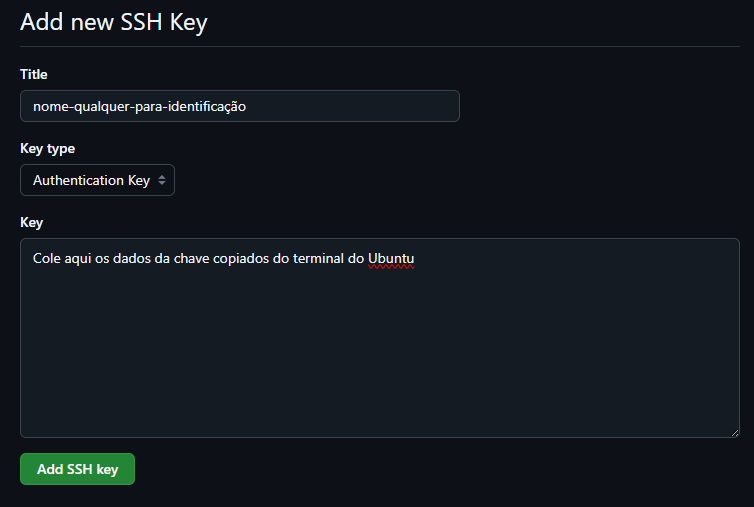
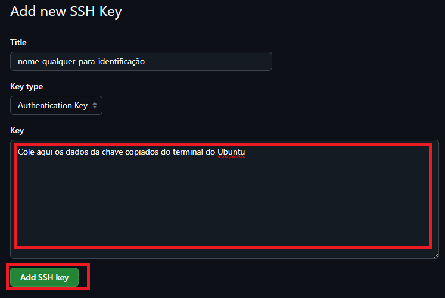
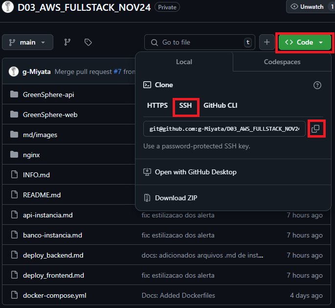
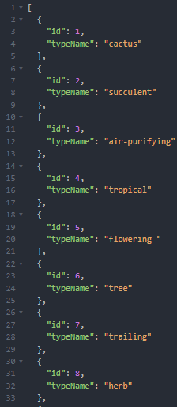

[AWS__BADGE]: https://img.shields.io/badge/AWS-%23FF9900.svg?style=for-the-badge&logo=amazon-aws&logoColor=white
[DOCKER__BADGE]: https://img.shields.io/badge/Docker-2496ED?style=for-the-badge&logo=docker&logoColor=white
[Postgres__BADGE]: https://img.shields.io/badge/postgres-%23316192.svg?style=for-the-badge&logo=postgresql&logoColor=white
[GitHub__BADGE]: https://img.shields.io/badge/github-%23121011.svg?style=for-the-badge&logo=github&logoColor=white

<div align="center">

<h1  style="font-weight: bold;"> Green Sphere Store<br>Backend Deployment no Amazon EC2</h1>

![AWS][AWS__BADGE]
![Postgres][Postgres__BADGE]
![DOCKERa][DOCKER__BADGE]
![GitHub_][GitHub__BADGE]

<a href="#about">Sobre</a> •
<a href="#config">Configurações Iniciais</a> •
<a href="#docker">Instalação do Docker e Docker Compose</a> •
<a href="#git">Conexão com repositório no GitHub</a> •
<a href="#db">Configuração do Banco de Dados (PostgreSQL) - GitHub + docker-compose</a> •
<a href="#api">Configuração da API (nodejs) - GitHub + docker-compose</a> •
<a href="#pop">Popular banco de dados</a> •
<a href="#next">Próximos Passos</a> •
<a href="#colab">Autor</a> •
<a href="#resources">Links Úteis</a>

</div>

<div>

<h2 id="about">📌 Sobre</h2>

Este documento tem como objetivo orientar no deploy da api e do banco de dados em sua respectivas instâncias EC2 do projeto Green Sphere Store.

<h2 id="config">⚙️ Configurações iniciais</h2>

**_Deseja configurar a instância do banco de dados? Siga:_**

- <a href="#docker">Instalação do Docker e Docker Compose</a>
- <a href="#git">Conexão com repositório no GitHub</a>
- <a href="#db">Configuração do Banco de Dados (PostgreSQL) - GitHub + docker-compose</a>

**_Deseja configurar a instância da API? Siga:_**

- <a href="#docker">Instalação do Docker e Docker Compose</a>
- <a href="#git">Conexão com repositório no GitHub</a>
- <a href="#api">Configuração da API (nodejs) - GitHub + docker-compose</a>

**Pré-requisitos:**

- Tenha certeza de que, nas instâncias EC2 com o sistema Ubuntu, [Banco de Dados](./banco-instancia.md) e [API](./api-instancia.md), a confguração do security group seja:
  - Banco de Dados: Abrir a porta 5432 para a instância da API;
  - API: Abrir a porta 3000 para teste externos e comunicação com o frontend.
- Tenha previamente testado sua conexão ambas via SSH usando o comando:

  ```bash
  ssh -i sua-chave-pública ubuntu@<IP-da-instância>
  ```

> [!WARNING]
>
>  <div style="border-left: 4px solid #F44336; padding: 10px; background: rgba(244, 67, 54, 0.1);">
>    Caso não tenha feito essas etapas, recomendo que volte e siga as instruções.

  </div>

</div>

<h2 id="docker">🛢️ Instalação do Docker e Docker Compose</h2>

- **Instalação do Docker e Docker Compose**

  - Atualizar pacotes:

    ```bash
    sudo apt update
    ```

    ```bash
    sudo apt upgrade -y
    ```

  - Instalar o Docker e Docker Compose:

    ```bash
    sudo snap install docker
    ```

  - **Verifique a instalação:**

    ```bash
    docker -v
    ```

    ```bash
    docker-compose -v
    ```

    Deverá esse tipo de resposta:

    ```makefile
    ubuntu@ip-banco-de-dados:~$ sudo snap install docker
    docker 27.2.0 from Canonical✓ installed
    ubuntu@ip-banco-de-dados:~$ docker -v
    Docker version 27.2.0, build 3ab4256
    ubuntu@ip-banco-de-dados:~$ docker-compose -v
    Docker version 27.2.0, build 3ab4256
    ```

  <div style="border-left: 4px solid #4CAF50; padding: 10px; background: rgba(76, 175, 80, 0.3);">

  Caso encontre dificuldades para chegar nesse resultado assista esse vídeo [AWS FÁCIL: Deploy de aplicação NodeJs + PostgreSQL no EC2](https://www.youtube.com/watch?v=iyiANe9Eszs&t=1483s)<br>
  Ou, se quiser tentar de outra forma, siga esse vídeo [Como fazer um deploy na Aws de uma aplicação no Docker? | Thi Code](https://www.youtube.com/watch?v=bVzjKJL2b2M&t=792s) e [documentação](https://busy-sunspot-00c.notion.site/Settings-for-EC2-db344aed5235413d9e0f71e6d457ba90)

  </div>

<div>

  <h2 id='next-docker'>🏃🏻‍♀️ Próximos Passos</h2>

1. <a href="#git">Conexão com repositório no GitHub na instância da Banco de Dados</a>
2. <a href="#db">Configuração do Banco de Dados (PostgreSQL) - GitHub + docker-compose</a>
3. [Criar instância da API](./api-instancia.md)
4. <a href="#docker">Instalação do Docker e Docker Compose na instância da API</a>
5. <a href="#git">Conexão com repositório no GitHub na instância da API</a>
6. <a href="#api">Configuração da API (nodejs) - GitHub + docker-compose</a>
7. <a href="#pop">(Opcional para testes) Popular banco de dados</a>
8. [Deploy do Frontend](./deploy_frontend.md)

</div>

<h2 id='git'>🛢️ Conexão com repositório no GitHub</h2>

**- Conectando o GitHub com a instância**

- No terminal da instância gere uma chave SSH e copie-a, executando os seguintes

  ```bash
  ssh-keygen -t rsa
  ```

  Exponha os dados da chave com:

  ```bash
  cat ~/.ssh/id_rsa.pub
  ```

  Deverá esse tipo de resposta:

  ```makefile
  ubuntu@ip-da-instância:~$ cat ~/.ssh/id_rsa.pub
  ssh-rsa chave-dados-da-chave= ubuntu@ip-da-instância
  ```

  Selecione os dados, copie, logue em sua conta do GitHub e siga os passos:

  1. Clique na sua foto e acesse as Settings

  2. Em SSH and GPG keys, gere uma nova chave:

   <div align="center">

  

  

  

  

  </div>

  Com isso sua conta está conectada com a instância.

**- Clonando repositório**

1. Vá até o repositório, clique em <kbd><> Code</kbd>, SSH e copie o comando para clonar o repositório.

<div align="center">



</div>

2. No terminal do Ubunto, execute o seguinte:

   ```bash
   git clone git@github.com:g-Miyata/D03_AWS_FULLSTACK_NOV24.git
   ```

3. Verique se deu certo:

   ```bash
   ls
   ```

   Deverá ter essa resposta:

   ```makefile
   ubuntu@ip-da-instância:~$ ls
   D03_AWS_FULLSTACK_NOV24
   ```

  <h2>🏃🏻‍♀️ Próximos passos</h2>

1.  <a href="#db">Configuração do Banco de Dados (PostgreSQL) - GitHub + docker-compose</a>
2.  [Criar instância da API](./api-instancia.md)
3.  <a href="#docker">Instalação do Docker e Docker Compose na instância da API</a>
4.  <a href="#git">Conexão com repositório no GitHub na instância da API</a>
5.  <a href="#api">Configuração da API (nodejs) - GitHub + docker-compose</a>
6.  <a href="#pop">(Opcional para testes) Popular banco de dados</a>
7.  [Deploy do Frontend](./deploy_frontend.md)

<h2 id='db'>🛢️ Configuração do Banco de Dados (PostgreSQL) com GitHub + docker-compose</h2>

**- Inicializar o container do Banco de Dados através do docker-compose**

1. Acesse a em que se encontra o arquivo docker-compose:

   ```bash
   cd D03_AWS_FULLSTACK_NOV24/GreenSphere-api/
   ```

   Verifique se o arquivo <kbd>docker-compose.yml</kbd> está no diretório:

   ```bash
   ls
   ```

   Deverá ter essa resposta:

   ```makefile
   ubuntu@ip-10-0-0-234:~/D03_AWS_FULLSTACK_NOV24/GreenSphere-api$ ls
   Dockerfile  dist  docker-compose.yml  node_modules  package-lock.json  package.json  prisma  src  tsconfig.json
   ```

2. Suba o container do banco de dados:

   ```bash
   cd D03_AWS_FULLSTACK_NOV24/GreenSphere-api/
   ```

   ```bash
   sudo docker-compose up -d postgres
   ```

   Verifique se o container subiu e está ativo:

   ```bash
   sudo docker ps
   ```

   Deverá ter essa resposta:

   ```makefile
   ubuntu@ip-10-0-0-234:~/D03_AWS_FULLSTACK_NOV24/GreenSphere-api$ docker ps
   CONTAINER ID   IMAGE             COMMAND                  CREATED         STATUS         PORTS                                       NAMES
   fff11f1b839b   postgres:latest   "docker-entrypoint.s…"   8 seconds ago   Up 7 seconds   0.0.0.0:5432->5432/tcp, :::5432->5432/tcp   postgres_db
   ```

  <h2>🏃🏻‍♀️ Próximos passos</h2>

1.  [Criar instância da API](./api-instancia.md)
2.  <a href="#docker">Instalação do Docker e Docker Compose</a>
3.  <a href="#git">Conexão com repositório no GitHub</a>
4.  <a href="#api">Configuração da API (nodejs) - GitHub + docker-compose</a>
5.  <a href="#pop">(Opcional para testes) Popular banco de dados</a>
6.  [Deploy do Frontend](./deploy_frontend.md)

<h2 id="api">🖧 Configuração da API (nodejs) - GitHub + docker-compose</h2>

1. Configure o arquivo .env com suas credenciais;

   ```bash
   nano .env
   ```

   Digite:

   ```javascript
    POSTGRES_USER=postgres
    POSTGRES_PASSWORD= sua-senha
    POSTGRES_DB= nome-db
    DATABASE_URL=postgresql://postgres:sua-senha<IP-da-instância-DB>:5432/nome-db
   ```

2. Suba o container da API:

   ```bash
   cd D03_AWS_FULLSTACK_NOV24/GreenSphere-api/
   ```

   ```bash
   sudo docker-compose up -d api
   ```

   Verifique se o container subiu e está ativo:

   ```bash
   sudo docker ps
   ```

   Deverá ter essa resposta:

   ```makefile
   ubuntu@ip-10-0-11-87:~/D03_AWS_FULLSTACK_NOV24/GreenSphere-api$ sudo docker ps
   CONTAINER ID   IMAGE                 COMMAND                  CREATED          STATUS          PORTS                                       NAMES
   a6efa5610347   greensphere-api-api   "docker-entrypoint.s…"   15 seconds ago   Up 13 seconds   0.0.0.0:3000->3000/tcp, :::3000->3000/tcp   green_api
   ```

  <h2>🏃🏻‍♀️ Próximos passos</h2>

1.  [Criar instância da API](./api-instancia.md)
2.  <a href="#docker">Instalação do Docker e Docker Compose</a>
3.  <a href="#git">Conexão com repositório no GitHub</a>
4.  <a href="#api">Configuração da API (nodejs) - GitHub + docker-compose</a>
5.  <a href="#pop">(Opcional para testes) Popular banco de dados</a>
6.  [Deploy do Frontend](./deploy_frontend.md)

<h2 id="pop"> Opcional: Popular banco de dados com dados fitícios para testes</h2>

**- Populando o Banco de Dados**

1. Vá no terminal do banco de dados e execute:

   ```
   docker exec -it postgres_db psql -U postgres -d desafio3
   ```

   ```
   \dt
   ```

   ```sql
   INSERT INTO "Type" ("id", "typeName")
   VALUES
   (1, 'cactus'),
   (2, 'succulent'),
   (3, 'air-purifying'),
   (4, 'tropical'),
   (5, 'flowering '),
   (6, 'tree'),
   (7, 'trailing'),
   (8, 'herb'),
   (9, 'fern'),
   (10, 'orchid'),
   (11, 'palm'),
   (12, 'grass-like'),
   (13, 'edible');
   SELECT * FROM "Type";
   ```

   ```sql
   INSERT INTO "Type" ("id", "typeName")
   VALUES
   (1, 'Echinocereus Cactus', 'A Majestic Addition', 'indoor', 1, 139.99, true, 20, 'Species: Echinocereus spp.', 'Ladyfinger cactus (Echinocereus pentalophus)', 'https://http2.mlstatic.com/D_NQ_NP_833120-MLB75616703076_042024-O.webp');
   SELECT * FROM "Type";
   ```

2. Faça teste com o Isominia ou Postman

<div align="center">

GET na rota http://IP-da-sua-API:3000/types



</div>

Com isso tem-se a validação de que a rota está funcionando.

<h2 id="next">🏃🏻‍♀️ Próximos passos</h2>

1.  [Deploy do Frontend](./deploy_frontend.md)

<h2 id="colab">🖌 Autor</h2>

<table align="center">
  <tr style="display: flex; justify-content: space-around;" >
    <td align="center">
      <br>
      <b>Guilherme Miyata</b><br>
      <a href="https://github.com/g-Miyata">
        
      </a>
      <a href="https://www.linkedin.com/in/guilherme-miyata-612a71219/">
        
      </a>
    </td>
  </tr>
</table>

<h2 id="resources">📄 Links úteis</h2>

- [🎥 Deploy React no S3 da AWS](https://www.youtube.com/watch?v=vosy6rEeOiw)
- [📚 Backend Deploy](./deploy_backend.md)
- [📚 Instância API](./api-instancia.md)
- [📚 Instância DB](./banco-instancia.md)
