[AmazonS3__BADGE]: https://img.shields.io/badge/Amazon%20S3-FF9900?style=for-the-badge&logo=amazons3&logoColor=white
[AWS__BADGE]: https://img.shields.io/badge/AWS-%23FF9900.svg?style=for-the-badge&logo=amazon-aws&logoColor=white
[VITE__BADGE]: https://img.shields.io/badge/Vite-646CFF?style=for-the-badge&logo=vite&logoColor=white
[REACT__BADGE]: https://img.shields.io/badge/React-61DAFB?style=for-the-badge&logo=react&logoColor=black

<h1  style="font-weight: bold;"> Green Sphere Store - Frontend Deployment no Amazon S3</h1>

<div align="center">

![AWS][AWS__BADGE]
![Amazon S3][AmazonS3__BADGE]
![REACT][REACT__BADGE]
![VITE][VITE__BADGE]

<a href="#about">Sobre</a> •
<a href="#config">Configurações Iniciais</a> •
<a href="#S3">Criação do bucket S3</a> •
<a href="#resources">Links Úteis</a>

</div>

<h2 id="about">📌 Sobre</h2>

Este documento tem como objetivo orientar na criação de um bucket S3 na Amazon AWS para hospedar o frontend em React do projeto Green Sphere Store.

<h2>⚙️ Configurações iniciais</h2>

Antes de criar o S3:

1. **Preparar o Frontend para Deploy**

   O Amazon S3 suporta apenas sites estáticos. Por isso, é necessário realizar o build do projeto React e fazer o upload do diretório <kbd>dist</kbd> no bucket S3.
   No terminal, no diretório do frontend, execute:

```bash
npm run build
```

> [!WARNING]
> Certifique-se de que o script de build está configurado corretamente no <kbd>package.json</kbd>:

```json
  "scripts": {
    "build": "tsc -b && vite build",
    "deploy": "aws s3 sync dist/ s3://frontend-d3 --acl public-read --profile Miyata"
  }
```

2. **Criar bucket S3**

   1. Selecione o serviço

    <div align="center">

   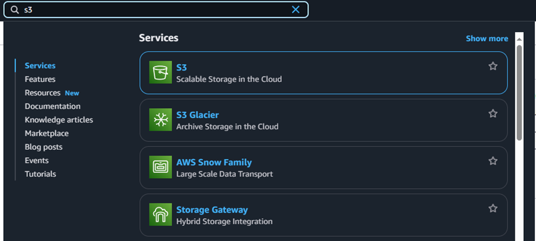
    </div>

   2. Siga os passos com atenção:

    <div align="center">

   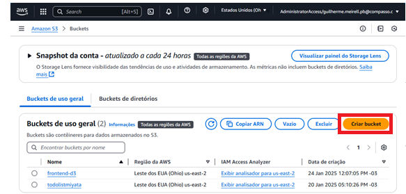
   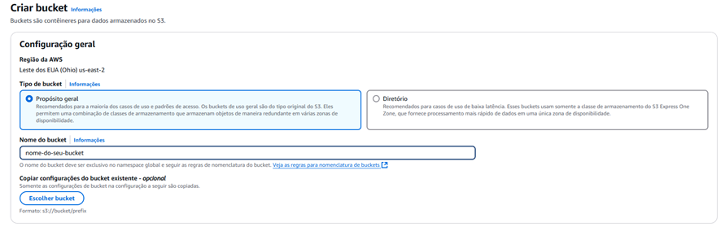

   > [!IMPORTANT]
   > Remova o bloqueio a acesso público

   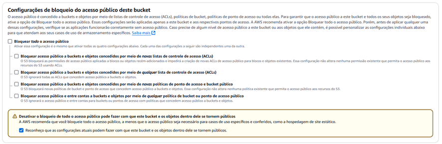
   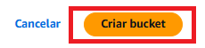

   Clique no bucket criado

   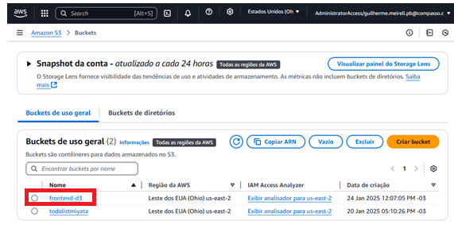

   Após o build, faça upload do diretório <kbd>dist</kbd> no bucket criado.

   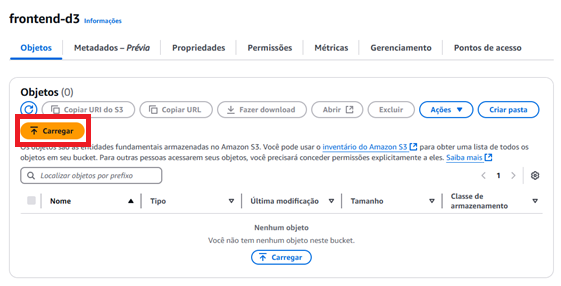

   No console do bucket, habilite a hospedagem de sites estáticos e configure a página inicial e a de erro:

   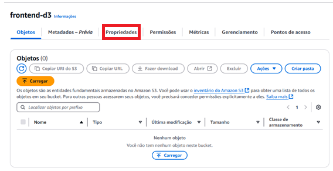
   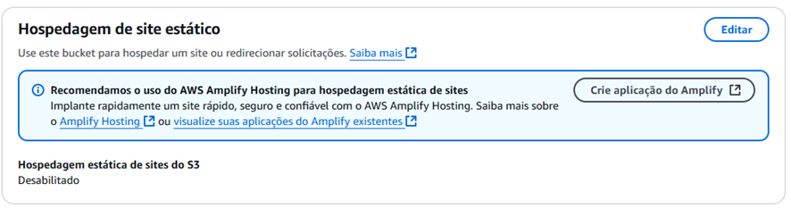

   Habilite a opção e configure da seguinte forma:

   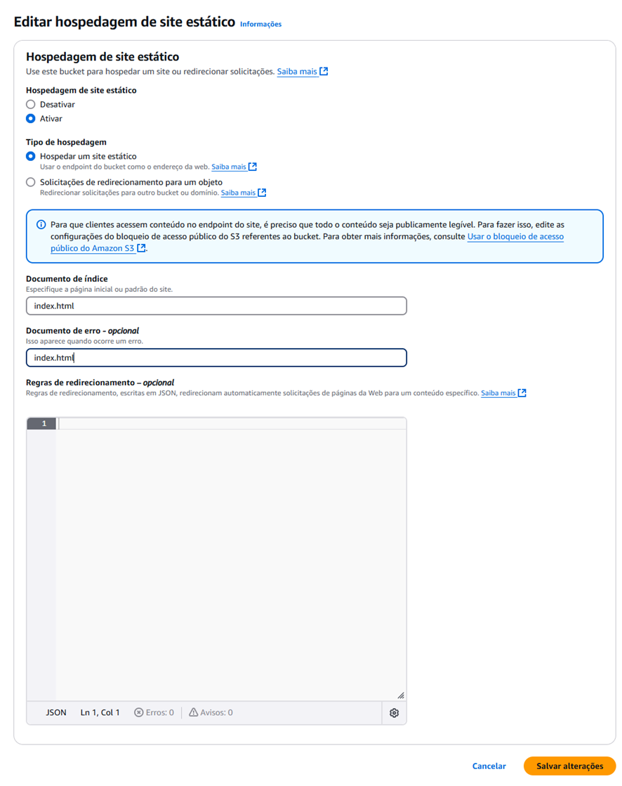

   Vá na aba de permissões e adicione uma política para permitir acesso público ao bucket:

   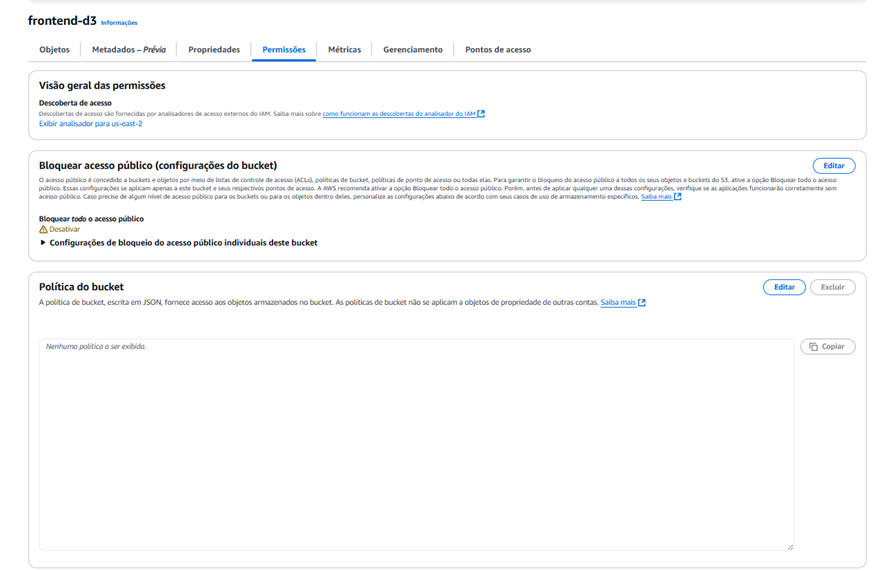
   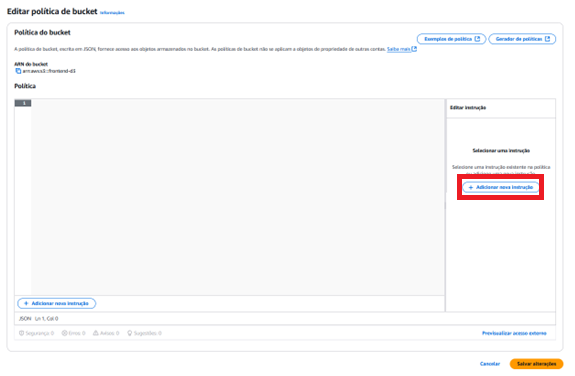
   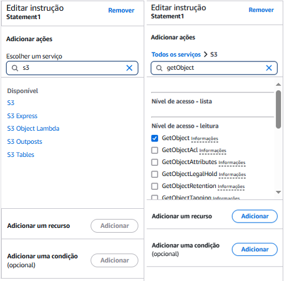

    </div>

> [!IMPORTANT]
> Certifique-se de sua política estar assim ao final:

```json
{
  "Version": "2012-10-17",
  "Statement": [
    {
      "Sid": "AllowPublicAccess",
      "Effect": "Allow",
      "Principal": "*",
      "Action": "s3:GetObject",
      "Resource": "arn:aws:s3:::nome-do-seu-bucket/*"
    }
  ]
}
```

<div align="center">

> [!IMPORTANT]
> Agora selecione todos os seus arquivos e torne-os públicos:

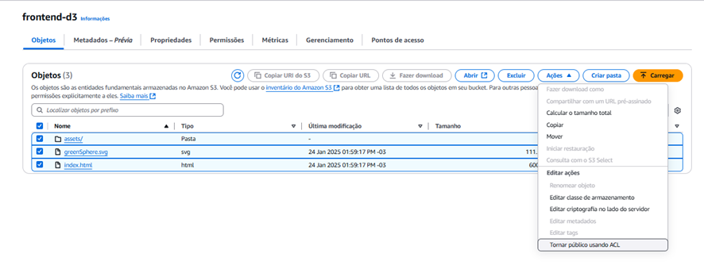

Após concluir a configuração, acesse o endpoint público do bucket, disponível na aba de propriedades.

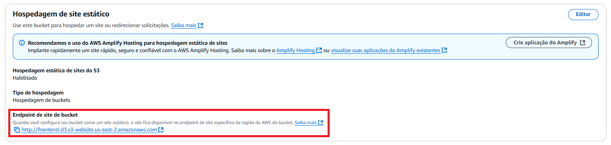

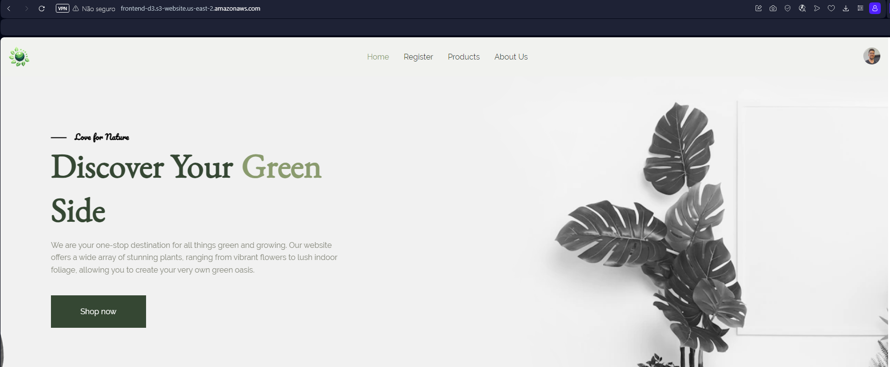

</div>

> [!NOTE]
> Se aparecer erro de acesso negado, revise as configurações de bloqueio público e permissões.

> [!TIP]
> Caso ainda tenha dúvidas verifique [🎥 Deploy React no S3 da AWS](https://www.youtube.com/watch?v=vosy6rEeOiw)

<h2 id="resources">📄 Links úteis</h2>

- [🎥 Deploy React no S3 da AWS](https://www.youtube.com/watch?v=vosy6rEeOiw)
- [📚 Backend Deploy](./deploy_backend.md)
- [📚 Instância API](./api-instancia.md)
- [📚 Instância DB](./banco-instancia.md)
